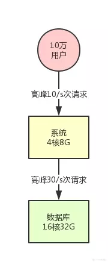
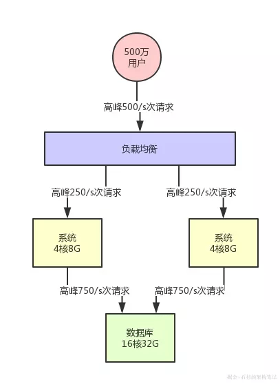
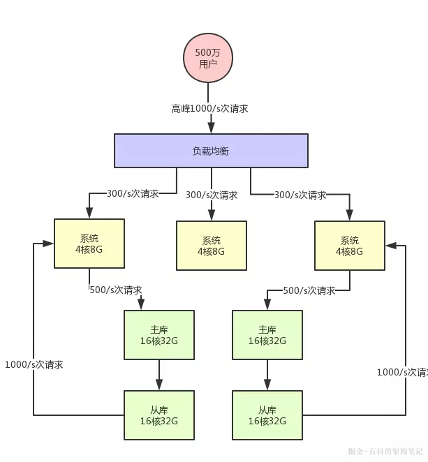
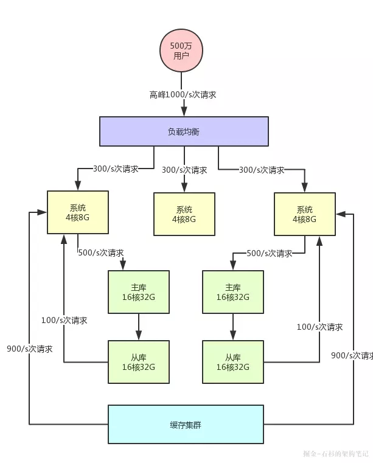
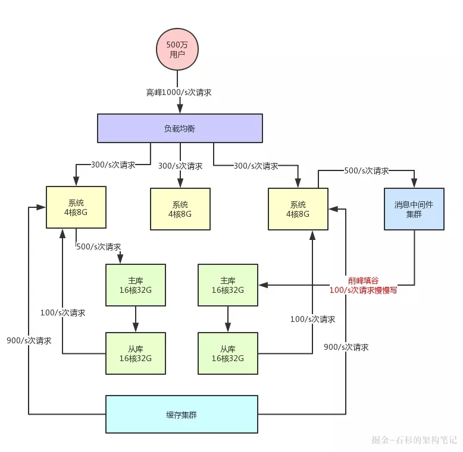

# 深入浅出：你的系统如何支撑高并发？

Paraphrasing and summraizing from  https://learnku.com/laravel/t/24359
## 100K Users？

假设： 总用户量只有10万左右，DAU10% = 1万人。高峰期有80%的DAU，平均每人在发送20次请求，那么最终下来也只有大约10qps，假设每个query都会访问3次db。

那么最后我们的估计：10qps for servers, 30 for db operations. 

那这样根本就不是高并发嘛！用一下最基本的架构就可以支撑。

## 5M Users？
假设：总用户量迅速增长，注册用户增长了50倍，达到了500万。那么我们估算高峰期系统是500qps，对数据库对请求是1500qps。
如果还是按照上面的架构的话，处理一些比较负责的逻辑是比较耗CPU的，不过数据库层面来说，1500qps是可以接受的。
所以，那么现在就要支持**系统**的集群化部署了！再多加一个机器吧！

1. 在整个系统最前面挂一个Load Balancer，把请求均匀的打到系统层面，那么现在每台机器就只有250qps了。

好的，哪怕用户增长了50倍，达到500万用户的时候其实只需要在我们之前的架构上增加一台server，和负责handle requests的load balancer我们就可以初步扛过了高并发。

## 10M Users！
假设：好了，你的App是一个Hit，用户疯狂的增长，达到了1000万，各大VC都排着队在你家门口要给你钱。

我们估算DAU在1M左右，那么峰值对时候对系统对qps可以达到1000，其实也没什么关系，上面我们也说过了，再多加一些server扩容就好了，反正load balancer会帮你把request均匀分布过去的。

但是这时候数据库就不好办，达到了3000的qps。因为数据库压力过大，高峰时系统的性能就会降低，万一数据库挂了呢？

2. 分库分表 + 读写分离： 把一个库拆分为多个库，部署在多个数据库服务上，这是作为主库承载**写入**请求的。每个主库都挂载至少一个从库，由从库来承载**读**请求

假设数据库的并发读写是3000qps，其实write占到了1000，read占到了2000。那么一旦分库（分成两个）之后，write和read各自下降了一半。
所以说：并发量继续增长时，我们就需要 focus 在数据库层面：分库分表、读写分离。

架构图如下：

### Wasted Resources？引入缓存！
那么如果你注册的用户量越来越大，你可以不断的加server，但是你也会一直分库分表，加数据库吗？这里引来了一个问题：数据库其实本身不是用来承载高并发请求的，所以通常来说，数据库单机每秒承载的并发就在几千的数量级，而且数据库使用的机器都是比较高配置，成本很高。

3. 引入Cache吧，特别是针对一些写少读多的系统(Twitter, Instagram)，而且Cache的设计就是为了承载高并发而生的，单机的承载量至少在几万qps以上。

比如我接着用上面的例子来说，虽然我们的读在2000qps左右，但很有可能1800次请求都是可以直接读缓存里面不怎么变化的数据。

那么加缓存的好处还有什么呢？可能未来你的系统读请求每秒都几万次了，但是可能80%~90%都是通过Cache来读的，且Cache里的机器可能单机每秒都可以支撑几万读请求，所以耗费机器资源很少，可能就两三台机器就够了。

### How do you handle write?

和Read类似，当你有每秒几万的write请求的时候，你总不能不断加给主库（注意我们主库负责写）加主机吧？那么有什么技术可以让我们handle write requests呢？

4. 引入Messaging Queue，削峰填谷！

假如说，你现在每秒是 1000 次写请求，其中比如 500 次请求是必须请求过来立马写入数据库中的，但是另外 500 次写请求是可以允许异步化等待个几十秒，甚至几分钟后才落入数据库内的。

那么你可以引入消息中间件集群，把允许异步化的每秒 500 次请求写入 MQ，然后基于 MQ 做一个削峰填谷。比如就以平稳的 100/s 的速度消费出来然后落入数据库中即可，此时就会大幅度降低数据库的写入压力。那么现在数据库层面接收的写请求压力，就成了 500/s + 100/s = 600/s 了。

MQ本身也是为了高并发而生的，所以通常也可以支撑几万甚至十万级的requests

架构图变成了如下： 

## 小结

1. Adding more servers + load balancing requests 
2. When db operations get heavy, shard and scale dbs. 
3. Introduce cache, esespecially for systems that are read heavy.
4. Introduce Messaging queue to handle write requests.  

当然，故事远远没有结束，解决高并发是十分困难的，而且不同的系统有不同的业务要求，其架构是非常复杂的。
架构的特点也不仅仅只有以上四点，对技术保持敬畏之心，不断学习才是王道